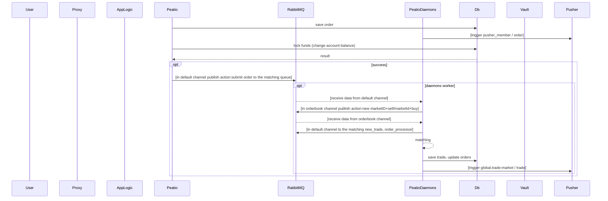

HEADER

```javascript
const Pusher = require("pusher")
```

> - [ ] | fsdfsf   | dfsdfsf   | sdfsdfsdf  |
>   | -------- | --------- | ---------- |
>   | dsfsdf   | sdfsdf    | sdfsdfsdfs |
>   | sdfsdfsd | sdfsdfsdf | sdfsdfsdf  |
>   |          |           |            |
>
>   

